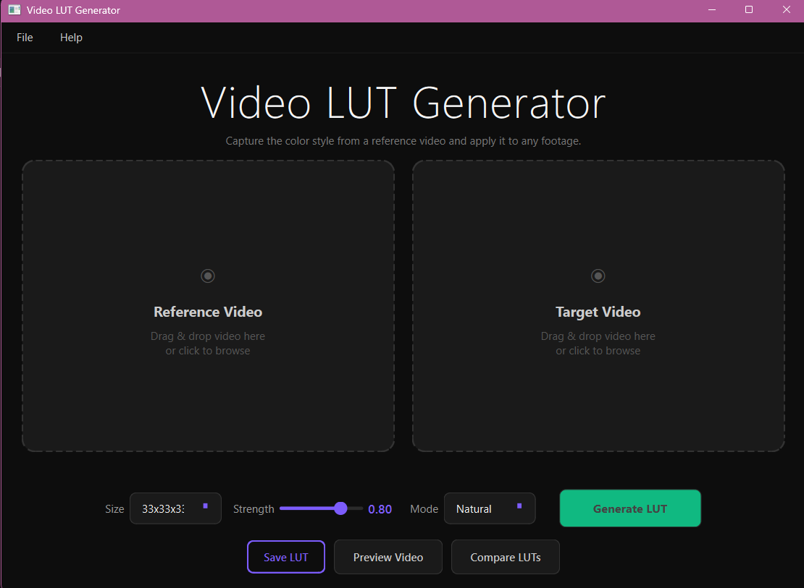
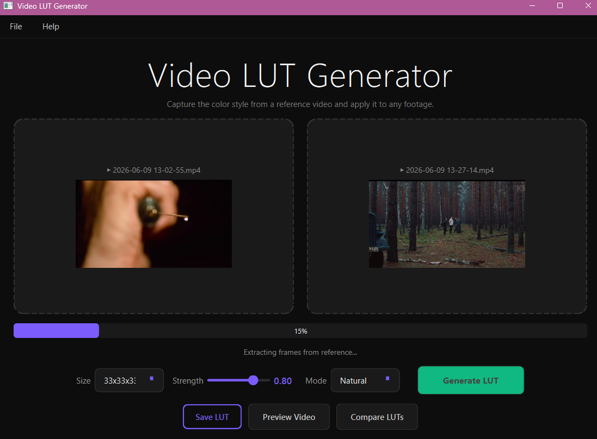
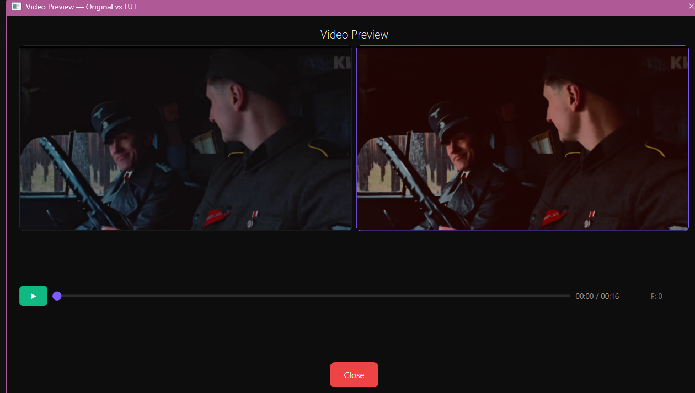
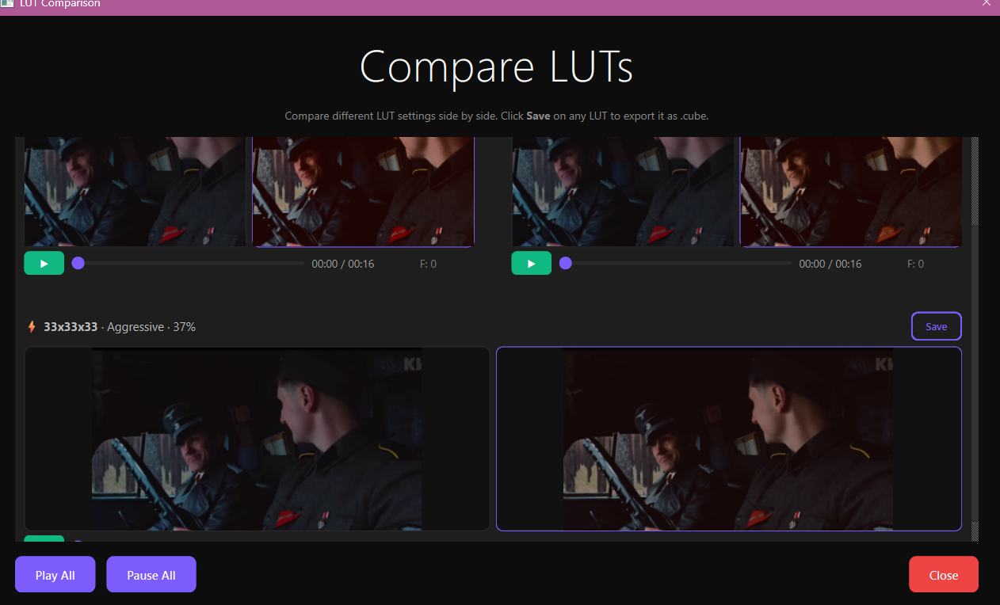

# Video LUT Generator

Professional desktop application for Windows that analyzes the color palette of a reference video and generates a .cube LUT file to transfer that color style to any target footage.

## Features

- **Drag & Drop** — drop reference and target videos directly into the app
- **Color Analysis** — 75+ evenly extracted frames, RGB/LAB histograms, brightness, contrast, saturation, color temperature
- **Tonal Splitting** — separate processing of shadows, midtones, and highlights
- **Reinhard Color Transfer** — color transfer in CIE LAB color space
- **LUT Generation** — sizes 17x17x17, 33x33x33, 65x65x65
- **.cube Export** — compatible with DaVinci Resolve, Adobe Premiere Pro, After Effects, Final Cut Pro, OBS Studio
- **Video Preview** — side-by-side before/after comparison
- **LUT Comparison** — compare multiple LUTs with different settings simultaneously
- **High Performance** — NumPy + Numba + multithreading

## Screenshots

| Main Window | Generating LUT |
|-------------|----------------|
|  |  |

| Video Preview | LUT Comparison |
|---------------|----------------|
|  |  |

## Installation

### Option 1: Download Installer

Download the latest release from [Releases](https://github.com/KOLRNCH/Video-LUT-Generator/releases) and run the installer.

### Option 2: Run from Source

```bash
git clone https://github.com/KOLRNCH/Video-LUT-Generator.git
cd Video-LUT-Generator
pip install -r requirements.txt
python main.py
```

## Requirements

- Windows 10/11
- Python 3.10+ (for running from source)
- 4+ GB RAM

## Dependencies

- PyQt6 — GUI framework
- OpenCV — video loading and frame extraction
- NumPy — numerical computation
- Numba — JIT compilation for LUT generation

## How It Works

1. Extract 75 frames from each video
2. Analyze color in RGB and CIE LAB spaces
3. Reinhard Color Transfer (mean/std in LAB)
4. Histogram Matching
5. Tonal-split correction (Shadows / Midtones / Highlights)
6. Adaptive saturation and contrast
7. 3D LUT interpolation with trilinear interpolation

## Project Structure

```
VideoLUTGenerator/
├── main.py                 # Entry point
├── requirements.txt
├── core/
│   ├── __init__.py
│   ├── video_loader.py     # Video loading (OpenCV)
│   ├── frame_extractor.py  # Frame extraction
│   ├── color_analysis.py   # Color analysis
│   ├── histogram_matching.py
│   ├── reinhard_transfer.py
│   ├── lut_generator.py    # 3D LUT generation
│   └── cube_exporter.py    # .cube export
└── ui/
    ├── __init__.py
    ├── main_window.py      # PyQt6 GUI
    └── video_preview.py    # Video preview player
```

## License

MIT
